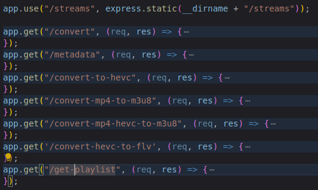

# Welcome! 👋
I create this project to learn more about FFMPEG
in Nodejs.

- You can see some drops of sweat here:


## Arquitetura do Projeto

O projeto segue uma arquitetura em camadas:

```
src/
├── config/       # Configurações da aplicação
├── controllers/  # Controladores para gerenciar requisições
├── routes/       # Definição das rotas da API
├── services/     # Serviços com a lógica de negócio
├── utils/        # Funções utilitárias
└── app.js        # Arquivo principal da aplicação
```

### Getting started
Install the dependencies:
```
npm i || yarn
```
and then run:
```
npm run start || yarn start
```

For development mode:
```
npm run dev || yarn dev
```

Listening in port 3000!
Happy coding 💻

## API Endpoints

- `GET /api/ffmpeg/convert` - Converte um vídeo para MP4
- `GET /api/ffmpeg/metadata` - Obtém metadados do vídeo
- `GET /api/ffmpeg/convert-to-hevc` - Converte um vídeo para HEVC
- `GET /api/ffmpeg/convert-mp4-to-m3u8` - Converte MP4 para M3U8 (HLS)
- `GET /api/ffmpeg/convert-mp4-hevc-to-m3u8` - Converte HEVC para M3U8 (HLS)
- `GET /api/ffmpeg/convert-hevc-to-flv` - Converte HEVC para FLV
- `GET /api/ffmpeg/get-playlist` - Obtém a URL da playlist

PS: I wrote this project in 1 hour, so don't notice the dirty code, 
I just wanted to explore the library in the time I had, 
I'll be back soon to improve more.
